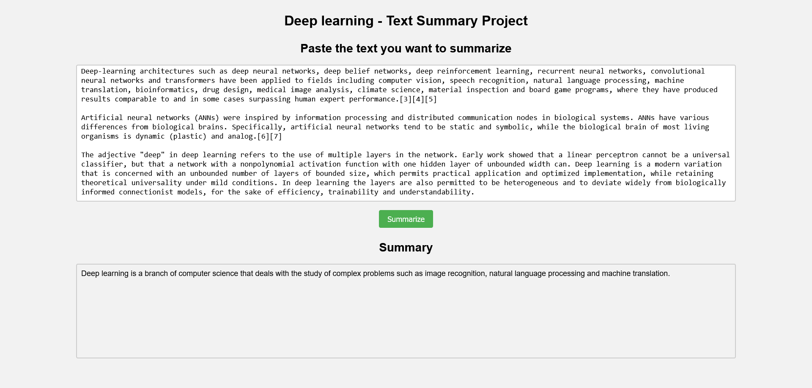

# Deep learning text summery app project

This web application is a basic text summary implementation using transformers and NLP to summarize your text in one sentence.

## Usage

The is no pipenv this time. You just have to install the packages on the pc (or create a pipenv and play with the packages a bit). These are the commands to need to run in order to make this application work for you:

```bash
pip install uvicorn fastapi transformers torch torchvision torchaudio --index-url https://download.pytorch.org/whl/cu118 sentencepiece
```

``uvicorn`` and ``fastapi`` are used for the server and the rest are used for the NLP model.

## How to run

### Server

Change your directory to the server using this command ``cd .\server`` (or by using the explorer) and run this command to start the server ``python .\main.py``.

### Client

Change your directory to the client folder and run the index.html file using the vs code extension "Live Server" or any other method of your choice.


### Outcome

This is what your are supposed to see when everything works:


